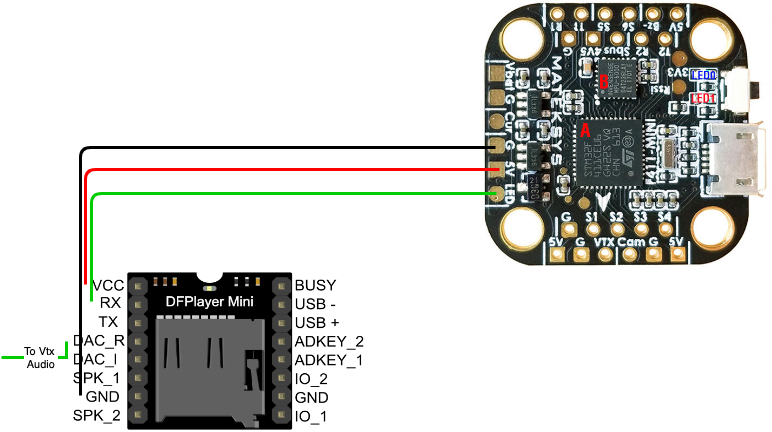
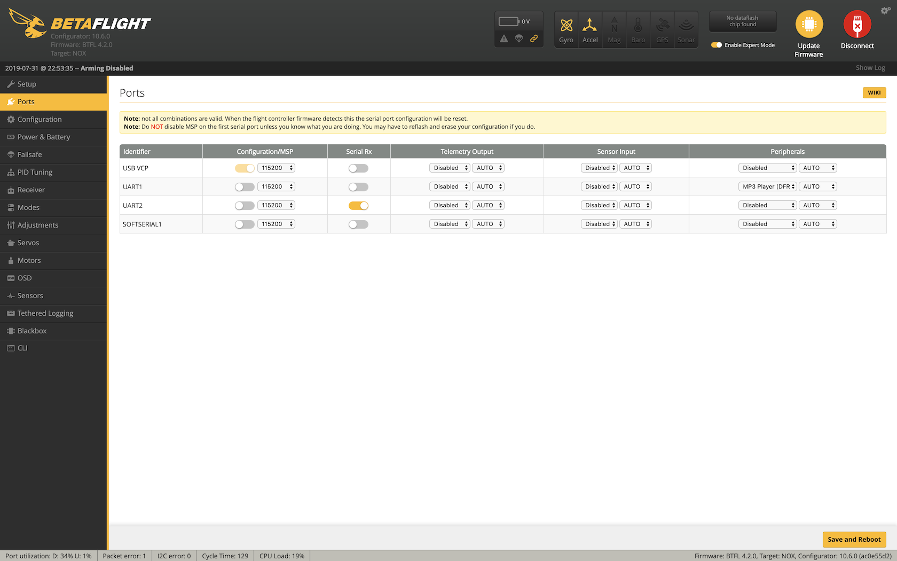
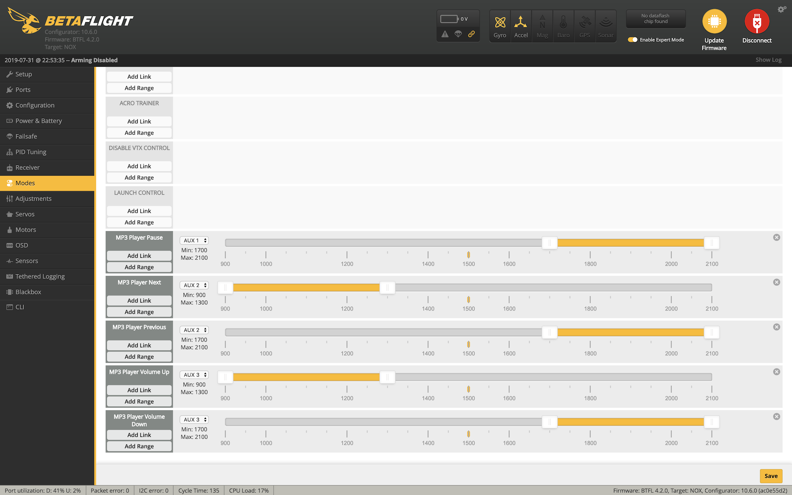
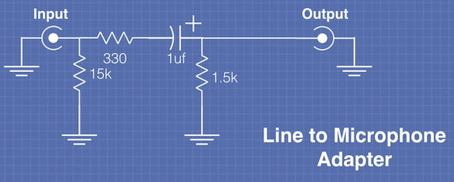
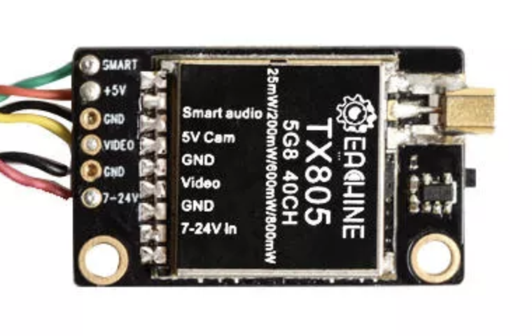
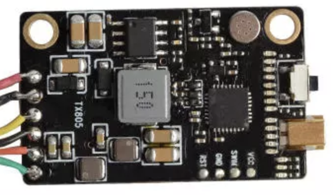

## Stupid ideas in FPV: MP3 player in a drone

Being in the midst of writing my Ph.D. thesis, I am currently very susceptible to mindless distractions.
This fork of Betaflight includes a driver for an MP3 player module by DFRobot.
There are incredibly cheap cloned boards out there:
https://www.aliexpress.com/wholesale?SearchText=dfplayer+mini

Documentation is available from DFRobot:
https://wiki.dfrobot.com/DFPlayer_Mini_SKU_DFR0299

The player module has an SD card slot and can play thousands of MP3 files from an SD card up to 2gb.

### Wiring
With the driver, you can wire the Tx pin of a spare UART (or softserial) of your flight controller to the Rx pin of the player module and control the player functions.

### Configuration
The media player controls can be selected in the __Ports__ tab in the Betaflight-Configurator.
The controls are assigned in the __Modes__ tab, just like the Runcam control buttons.
In order to set the according parameters you have to download my fork of the betaflight-configurator:
https://github.com/ameeuw/betaflight-configurator

Select the _MP3 Player (DFRobot Protocol)_ option in the _Peripherals_ combobox of the respective UART and hit __Save and Reboot__.

Set the mode switches according to your preference.
I suggest that you have at least _MP3 Player Play/Pause_ and _MP3 Player Next_ mapped to a switch, so that you can start, stop, and skip playback of your tracks.

Available controls are:
- Play / Pause
- Next Track
- Previous Track
- Volume Up
- Volume Down

As the keys are buttons, I re-used the code for toggle recognition from the rcdevice-cam driver, so behaviour should be the same.
For control of my Runcam Split, I exchanged two of my FrSky Taranis' 3-position switches (SD and SC) with momentary 3-position switches.
I am very happy to have suggestions how control could be alternatively done.
I have thought about using the _Adjustments_ to control volume, for example, but I haven't gotten nowhere close to realising that.

### Video

I made a cut from my Commander's DVR. The quality is terrible since there is some audible DVR artefacts and the video is just b/w... no idea what was wrong.
However, its working nicely and its really a lot of fun - especially if you have some of your favourites on there and can try to hit lines along the beat.

### Further thoughts

The player module puts out line-level signal.
This can be directly connected to VTXs with an audio pin.
I use an ATX03 from Eachine and it works flawlessly.

The output is not directly suitable for VTXs with a microphone input (such as the FuriousFPV).
Here is a circuit of an attenuator (and impedance matcher?) to adapt line-level to microphone level (found here: https://www.youtube.com/watch?v=aovtGu_pG4w&t=420s).
<!--  -->

I love the internet for things like this.

However, I feel that the nicest way to connect the audio would be to use a VTX with an exposed module (such as the Eachine TX805) and find the line-in pin.
If we wire up the DACL and DACR pin from the player module to the line-in pin of the VTX's module, we could control the volume of the player if we want to hear more prop noise from the microphone, and turn the volume up to listen to the music.
Since I do not know which one is the line-in pin (anybody?), I have not used this VTX yet.

<!--
### Aomway Commander and Airpods
To listen to the high quality tunes coming in from the quad, I did a mod on my Aomway Commander googles and added a bluetooth audio transmitter module.
These modules can also be found super cheaply from Aliexpress:
https://www.aliexpress.com/item/33040897766.html

The module is connected to ground, left-, and right-audio pins of the RCA jack.
The 5v pin of the USB plug is wired to the 5v rail on the Commander motherboard and powers up when the goggles are powered.
The module goes into pairing mode each time it is powered, so that unpaired headphones connect immediately.
-->

# BETAFLIGHT README

(Please see the [note](https://github.com/betaflight/betaflight#end-of-active-development-for-stm32f3-based-flight-controllers) below.)

Betaflight is flight controller software (firmware) used to fly multi-rotor craft and fixed wing craft.

This fork differs from Baseflight and Cleanflight in that it focuses on flight performance, leading-edge feature additions, and wide target support.

## News

### New requirements for the submission of new and updated targets

As [announced earlier](https://github.com/betaflight/betaflight#betaflight-40), Betaflight 4.0 is introducing a radically new way to define targets, the so-called 'Unified Targets'.

This new approach makes it possible to use the same firmware binary (the so called 'Unified Target firmware') for all boards that share the same MCU type (only supported on F4 and F7). Manufacturers will be able to add support for new boards by simply publishing a new configuration (the so called 'Unified Target configuration') for their new board. Users can then simply load the already published Unified Target firmware and the new Unified Target configuration onto their new board to get it to work.

Work to give users a simple way to flash unified targets in Betaflight configurator still needs to be done, so Betaflight 4.0 will be released with targets done in the 'legacy' way. But the plan is to add support for seamless use of Unified Targets into Betaflight configurator after Betaflight 4.0 has been released, and convert all of the existing F4 and F7 targets to the new format before the release of Betaflight 4.1.

In order to be prepared for this move, the following new requirements for pull requests adding new targets or modifying existing targets are put in place from now on:

1. After the release of Betaflight 4.0.0, new F3 based targets can only be added into the `4.0.x-maintenance` branch. This ties in with the release of firmware for F3 based targets [ending after 4.0](https://github.com/betaflight/betaflight#end-of-active-development-for-stm32f3-based-flight-controllers);

All subsequent rules exclude F3 based targets:

2. For any new target that is to be added, both a 'legacy' format target definition into `src/main/target/` and a new Unified Target config into `unified_targets/configs/` need to be submitted. See the [instructions](https://github.com/betaflight/betaflight/blob/master/unified_targets/docs/CreatingAUnifiedTarget.md) for how to create a Unified Target configuration;

3. For changes to existing targets, the change needs to be applied to both the 'legacy' format target definition in `src/main/target/` and a new Unified Target config in `unified_targets/configs/`. If no Unified Target configuration for the target exists, a new Unified Target configuration will have to be created and submitted alongside the proposed change.

### End of active development for STM32F3 based flight controllers

For a while now, development of Betaflight for flight controllers based on the STM32F3 chip has been hampered by a severe limitation that this chip has: Unlike the STM32F4 and STM32F7 models, the STM32F3 versions that are used on flight controllers have only a very limited amount of flash space available to fit the firmware into. This has meant that, starting from around version 3.3, the majority of the new features that were developed for Betaflight could not be added to STM32F3 based boards. Even worse, due to improvement in basic features, other more and more of the less commonly used features had to be removed from these flight controllers, and a number of them are at a point where they only support the bare minimum of functionality required to make them fly.

This means that, even if we kept supporting STM32F3 based boards in future releases, there would only be little advantage in this, as there simply is no space left on STM32F3 to add any of the new features that these releases will contain.

For this reason, and because the effort required to remove features from STM32F3 based flight controllers on a weekly basis is cutting into the time that we have to actually develop new features, we have decided to drop support for STM32F3 based flight controllers after the last release of 4.0.

This does not mean that it won't be possible to use these flight controllers after this point in time - they will still work fine when used with the last release of 4.0, just as there are thousands of users who are still enjoying their STM32F1 based flight controllers with Betaflight 3.2.5. We will also strive to keep these versions supported in new releases of configurator, so that users still using these flight controllers will be able to configure them with the same configurator that they use to configure their STM32F4 and STM32F7 based boards.

## Events

| Date  | Event |
| - | - |
| 01 September 2019 | Planned [release](https://github.com/betaflight/betaflight/milestone/30) date for Betaflight 4.1 |

## Features

Betaflight has the following features:

* Multi-color RGB LED strip support (each LED can be a different color using variable length WS2811 Addressable RGB strips - use for Orientation Indicators, Low Battery Warning, Flight Mode Status, Initialization Troubleshooting, etc)
* DShot (150, 300, 600 and 1200), Multishot, and Oneshot (125 and 42) motor protocol support
* Blackbox flight recorder logging (to onboard flash or external microSD card where equipped)
* Support for targets that use the STM32 F7, F4 and F3 processors
* PWM, PPM, and Serial (SBus, SumH, SumD, Spektrum 1024/2048, XBus, etc) RX connection with failsafe detection
* Multiple telemetry protocols (CSRF, FrSky, HoTT smart-port, MSP, etc)
* RSSI via ADC - Uses ADC to read PWM RSSI signals, tested with FrSky D4R-II, X8R, X4R-SB, & XSR
* OSD support & configuration without needing third-party OSD software/firmware/comm devices
* OLED Displays - Display information on: Battery voltage/current/mAh, profile, rate profile, mode, version, sensors, etc
* In-flight manual PID tuning and rate adjustment
* Rate profiles and in-flight selection of them
* Configurable serial ports for Serial RX, Telemetry, ESC telemetry, MSP, GPS, OSD, Sonar, etc - Use most devices on any port, softserial included
* VTX support for Unify Pro and IRC Tramp
* and MUCH, MUCH more.

## Installation & Documentation

See: https://github.com/betaflight/betaflight/wiki

## Support and Developers Channel

There's a dedicated Slack chat channel here:

https://slack.betaflight.com/

Etiquette: Don't ask to ask and please wait around long enough for a reply - sometimes people are out flying, asleep or at work and can't answer immediately.

## Configuration Tool

To configure Betaflight you should use the Betaflight-configurator GUI tool (Windows/OSX/Linux) which can be found here:

https://github.com/betaflight/betaflight-configurator/releases/latest

## Contributing

Contributions are welcome and encouraged. You can contribute in many ways:

* Documentation updates and corrections.
* How-To guides - received help? Help others!
* Bug reporting & fixes.
* New feature ideas & suggestions.

The best place to start is the Betaflight Slack (registration [here](https://slack.betaflight.com/). Next place is the github issue tracker:

https://github.com/betaflight/betaflight/issues
https://github.com/betaflight/betaflight-configurator/issues

Before creating new issues please check to see if there is an existing one, search first otherwise you waste peoples time when they could be coding instead!

If you want to contribute to our efforts financially, please consider making a donation to us through [PayPal](https://paypal.me/betaflight).

If you want to contribute financially on an ongoing basis, you should consider becoming a patron for us on [Patreon](https://www.patreon.com/betaflight).

## Developers

Contribution of bugfixes and new features is encouraged. Please be aware that we have a thorough review process for pull requests, and be prepared to explain what you want to achieve with your pull request.
Before starting to write code, please read our [development guidelines](docs/development/Development.md ) and [coding style definition](docs/development/CodingStyle.md).

TravisCI is used to run automatic builds

https://travis-ci.com/betaflight/betaflight

## Betaflight Releases

https://github.com/betaflight/betaflight/releases

## Open Source / Contributors

Betaflight is software that is **open source** and is available free of charge without warranty to all users.

Betaflight is forked from Cleanflight, so thanks goes to all those whom have contributed to Cleanflight and its origins.

Origins for this fork (Thanks!):
* **Alexinparis** (for MultiWii),
* **timecop** (for Baseflight),
* **Dominic Clifton** (for Cleanflight),
* **borisbstyle** (for Betaflight), and
* **Sambas** (for the original STM32F4 port).

The Betaflight Configurator is forked from Cleanflight Configurator and its origins.

Origins for Betaflight Configurator:
* **Dominic Clifton** (for Cleanflight configurator), and
* **ctn** (for the original Configurator).

Big thanks to current and past contributors:
* Budden, Martin (martinbudden)
* Bardwell, Joshua (joshuabardwell)
* Blackman, Jason (blckmn)
* ctzsnooze
* Höglund, Anders (andershoglund)
* Ledvina, Petr (ledvinap) - **IO code awesomeness!**
* kc10kevin
* Keeble, Gary (MadmanK)
* Keller, Michael (mikeller) - **Configurator brilliance**
* Kravcov, Albert (skaman82) - **Configurator brilliance**
* MJ666
* Nathan (nathantsoi)
* ravnav
* sambas - **bringing us the F4**
* savaga
* Stålheim, Anton (KiteAnton)

And many many others who haven't been mentioned....
